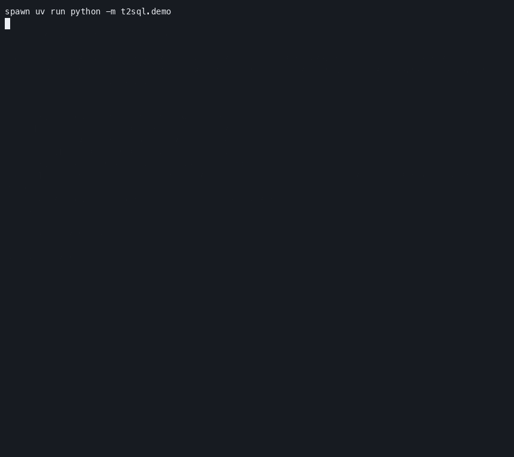
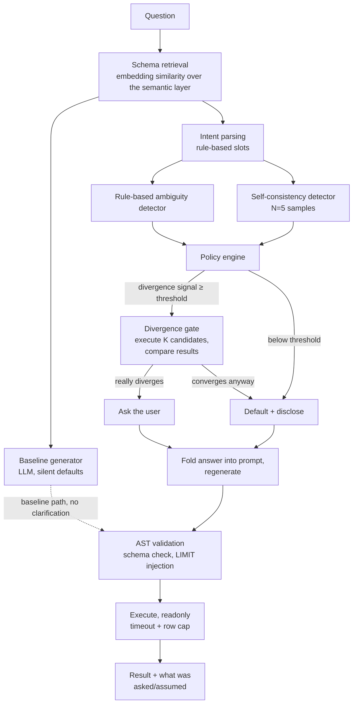

# text-to-sql, with a clarification engine

Text-to-SQL systems answer ambiguous questions confidently and wrong. This project adds a
clarification layer that measures whether an ambiguity would actually change the answer
before deciding whether to ask, default and disclose, or stay silent — and reports how often
it gets that call right, on a held-out test set, against five alternative detection
strategies.

**Baseline answered 95.1% of ambiguous questions confidently and wrongly — no clarification,
no disclosure, just a silently-wrong answer. The full system reduced that to 22.0%, while
asking on only 30.0% of *all* queries (ambiguous and unambiguous combined).**

## Demo



This is a live run, not a replay: "Who is our best customer?" against a real model.
`baseline` silently ranks customers by revenue; asked which metric was meant and told
"number of orders" instead, the resolved answer's top-5 shares **zero customers** with
baseline's — same question, same data, a completely different answer depending on what
"best" means.

Run it yourself: `make up && make demo` — 6 curated questions replay real, already-evaluated
results for free (no API key needed), or type your own question (like above) for a live run
against a real model (a couple of cheap-model calls, with a cost estimate and confirmation
before anything is sent).

## Ambiguity taxonomy

Seven types this schema and semantic layer deliberately admit more than one reading for —
worked SQL examples for each in [`docs/taxonomy.md`](docs/taxonomy.md).

| type | what's unstated | example |
|---|---|---|
| METRIC | which metric ("best", "top", "most valuable") | "Who is our best customer?" |
| TEMPORAL | calendar vs. trailing window, anchored to when | "How many orders did we get last month?" |
| ENTITY | which table/grain a noun maps to | "How many customers do we have?" |
| SCOPE | which rows count (refunds, cancellations, internal accounts, soft-deletes) | "How many orders have we had?" |
| GRAIN | the denominator/grouping level of an aggregate | "What's our average order value?" |
| COMPARISON | growth relative to what baseline | "Which category is growing the fastest?" |
| RESULT_SHAPE | how many rows in a ranked list | "Show me our top customers by revenue." |

## Architecture



Every stage left of the LLM boxes (retrieval, rule detection, the policy decision, the
divergence gate, AST validation) runs without a model call. Only baseline generation, the
self-consistency samples, and the post-clarification regeneration touch the LLM.

## Quickstart

```bash
git clone <this repo> && cd text-to-sql
cp .env.example .env          # fill in OPENROUTER_API_KEY only if you want to run generation/eval
make up                       # postgres in docker, seeded schema
make seed                     # generate + load the synthetic e-commerce dataset
make test                     # full suite -- LLM-gated tests skip without an API key
make demo                     # no API key needed -- replays real evaluation results
```

Running the actual pipeline against a live model (`python -m t2sql.eval run ...`) or
re-running the ablation (`make ablation`) needs a real `OPENROUTER_API_KEY` and spends real
money — the demo above does not.

## Dataset

200 hand-constructed, hand-verified questions (100 unambiguous, 100 ambiguous) against a
seeded e-commerce schema, split 120/80 into dev/test with a documented discipline: the test
split is touched exactly once, at the point `results/RESULTS.md` was produced, and never
again. Full construction method and label definitions: [`data/DATASET.md`](data/DATASET.md).

## Further reading

- [`results/RESULTS.md`](results/RESULTS.md) — full ablation numbers, per-ambiguity-type
  breakdown, confidence intervals, qualitative examples
- [`docs/FAILURE_ANALYSIS.md`](docs/FAILURE_ANALYSIS.md) — every test-set failure,
  categorized and counted, plus what a production version would need
- [`docs/BLOG_POST_MEDIUM.md`](docs/BLOG_POST_MEDIUM.md) — the write-up: the over-asking problem, the
  divergence insight, and one thing that didn't work
- [`docs/taxonomy.md`](docs/taxonomy.md) — worked SQL examples for all seven ambiguity types
- [`data/DATASET.md`](data/DATASET.md) — dataset construction method and label definitions
