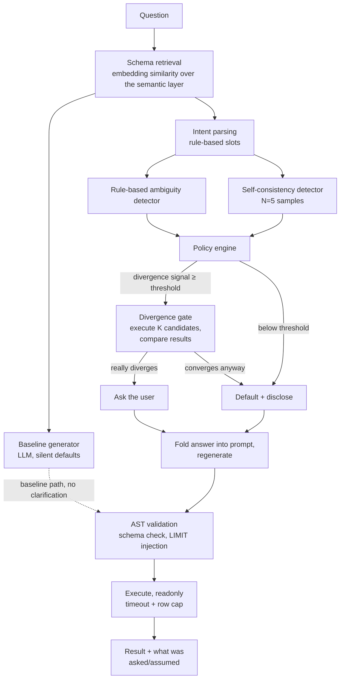

# text-to-sql, with a clarification engine

Text-to-SQL systems answer ambiguous questions confidently and wrong. This project adds a
clarification layer that measures whether an ambiguity would actually change the answer
before deciding whether to ask, a default-and-disclose, or stay silent — and reports how
often it gets that call right, on a held-out test set, against five alternative detection
strategies.

**Baseline answered 95.1% of ambiguous questions confidently and wrongly — no clarification,
no disclosure, just a silently-wrong answer. The full system reduced that to 22.0%, while
asking on only 30.0% of *all* queries (ambiguous and unambiguous combined).**

Full numbers, per-ambiguity-type breakdown, confidence intervals, and worked examples:
[`results/RESULTS.md`](results/RESULTS.md).

## Demo

*90-second GIF pending — see [`results/RESULTS.md`](results/RESULTS.md#qualitative-examples)
for the same beats in writing in the meantime. Run it yourself: `make up && make demo`
(reuses real, already-evaluated results — no API key needed).*

## Ablation (held-out test set, 80 items, run once)

| config | correctness | over-ask rate | detection P/R/F1 | silent-error rate | est. cost/query | est. latency/query |
|---|---|---|---|---|---|---|
| baseline | 23.8% | 0.0% | 0.00/0.00/0.00 | 76.2% | $0.0042 | ~3.8s |
| llm_judge | 25.0% | 38.8% | 0.71/0.95/0.81 | 40.0% | $0.0055 | ~5.8s |
| rules_only | 25.0% | 45.0% | 0.83/0.73/0.78 | 35.0% | $0.0054 | ~4.8s |
| self_consistency_only | 23.8% | 18.8% | 0.73/0.27/0.39 | 57.5% | $0.0254 | ~22.6s |
| hybrid_no_gate | 25.0% | 50.0% | 0.78/0.76/0.77 | 30.0% | $0.0266 | ~23.6s |
| **full** | 23.8% | **30.0%** | 0.78/0.76/0.77 | **30.0%** | $0.0260 | ~23.1s |

`full` vs. `hybrid_no_gate` is the load-bearing row: the divergence gate cuts over-asking
from 50.0% to 30.0% with *no* silent-error cost. Every config ran on the same (cheap) model,
`baseline` included — see [Limitations](#limitations).

## Ambiguity taxonomy

Seven types this schema and semantic layer deliberately admit more than one reading for —
worked SQL examples for each in [`docs/taxonomy.md`](docs/taxonomy.md).

| type | what's unstated | default policy | example |
|---|---|---|---|
| METRIC | which metric ("best", "top", "most valuable") | ASK | "Who is our best customer?" |
| TEMPORAL | calendar vs. trailing window, anchored to when | DEFAULT + disclose | "How many orders did we get last month?" |
| ENTITY | which table/grain a noun maps to | ASK | "How many customers do we have?" |
| SCOPE | which rows count (refunds, cancellations, internal accounts, soft-deletes) | DEFAULT + disclose | "How many orders have we had?" |
| GRAIN | the denominator/grouping level of an aggregate | ASK | "What's our average order value?" |
| COMPARISON | growth relative to what baseline | ASK | "Which category is growing the fastest?" |
| RESULT_SHAPE | how many rows in a ranked list | DEFAULT + disclose | "Show me our top customers by revenue." |

(`default policy` is this taxonomy's documented intent per type — the actual decision engine
scores every type uniformly against a measured divergence signal rather than switching on
type; see [Limitations](#limitations).)

## Architecture



Every stage left of the LLM boxes (retrieval, rule detection, the policy decision, the
divergence gate, AST validation) runs without a model call. Only baseline generation, the
self-consistency samples, and the post-clarification regeneration touch the LLM.

## Quickstart

```bash
git clone <this repo> && cd text-to-sql
cp .env.example .env          # fill in OPENROUTER_API_KEY only if you want to run generation/eval
make up                       # postgres in docker, seeded schema
make seed                     # generate + load the synthetic e-commerce dataset
make test                     # full suite -- LLM-gated tests skip without an API key
make demo                     # no API key needed -- replays real evaluation results
```

Running the actual pipeline against a live model (`python -m t2sql.eval run ...`) or
re-running the ablation (`make ablation`) needs a real `OPENROUTER_API_KEY` and spends real
money — the demo above does not.

## Dataset

200 hand-constructed, hand-verified questions (100 unambiguous, 100 ambiguous) against a
seeded e-commerce schema, split 120/80 into dev/test with a documented discipline: the test
split is touched exactly once, at the point `results/RESULTS.md` was produced, and never
again. Full construction method, label definitions, and known limitations:
[`data/DATASET.md`](data/DATASET.md).

## Limitations

- **Every config in the ablation table ran on the cheap model** (`claude-haiku-4.5`,
  `baseline` included) — a budget decision (this whole remaining project ran on a few
  dollars of credit), not a hidden shortcut. It's almost certainly why raw correctness sits
  at ~24% everywhere: the cheap model has a real, observed structural weakness (asked "who's
  our best customer," it returns a full ranked table instead of picking one row), which no
  amount of clarification fixes since it's orthogonal to which ambiguity got resolved. The
  *relative* comparison between configs — the actual point of the ablation — should be far
  less sensitive to this than the absolute numbers are.
- **GRAIN ambiguity is the weakest detection category** across all three mechanisms tested —
  see `results/RESULTS.md`'s per-type breakdown and example 3.
- **Self-consistency's recall stays low** (0.24–0.27) at the threshold calibrated on dev and
  reconfirmed on test — a documented tradeoff favoring low false-fire over high catch rate.
- **Regeneration after clarification isn't fully isolated** — resolving one slot can silently
  change another, since it's a second independent LLM call, not a surgical edit to the first.
- Full breakdown, categorized by failure type with counts: `docs/FAILURE_ANALYSIS.md`.

## Out of scope

Cut deliberately: fine-tuning, charts/visualization, multi-database dialects, RAG over query
logs, auth and multi-tenancy, conversational memory beyond slot resolution, streaming
responses.

## What I'd do next

1. **Re-run the headline numbers on a top-tier generation model.** The cheap-model
   correctness floor (~24% everywhere) makes the ablation's *relative* story visible but
   muddies the *absolute* one — a real deployment decision needs both.
2. **Fix GRAIN detection specifically** — it's the one taxonomy type none of the three
   mechanisms catch reliably; likely needs a dedicated rule (aggregate function + no stated
   grouping noun) rather than relying on self-consistency to notice.
3. **Make regeneration surgical.** A targeted SQL edit for the resolved slot, instead of a
   full independent regeneration call, would remove the "unrelated side effect" failure mode
   documented in `results/RESULTS.md` example 2 — and cost less.
4. **Raise self-consistency's N** (or its threshold's sensitivity) now that there's a
   held-out confirmation of its low-recall tradeoff, rather than dev-set calibration alone.
