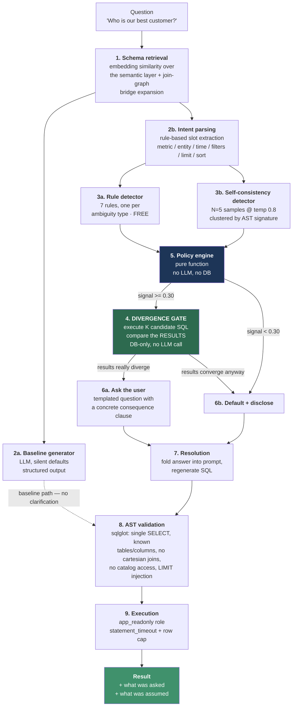
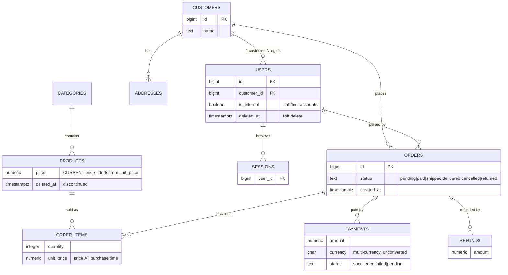
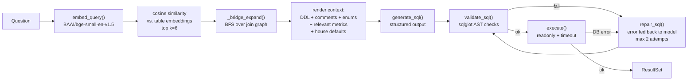
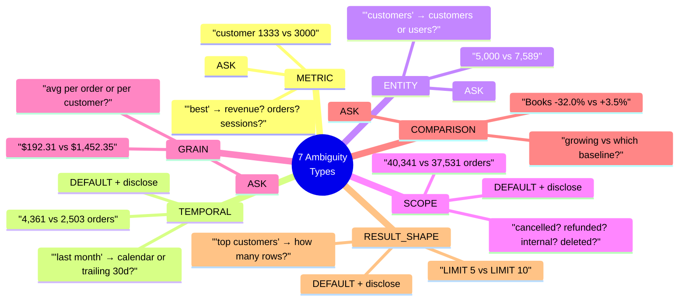
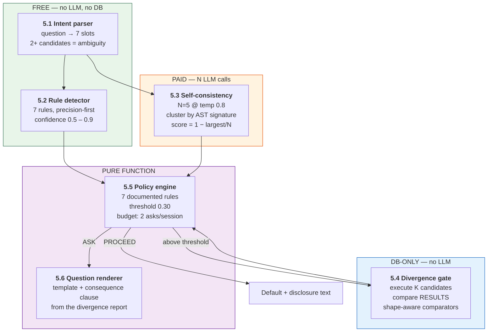
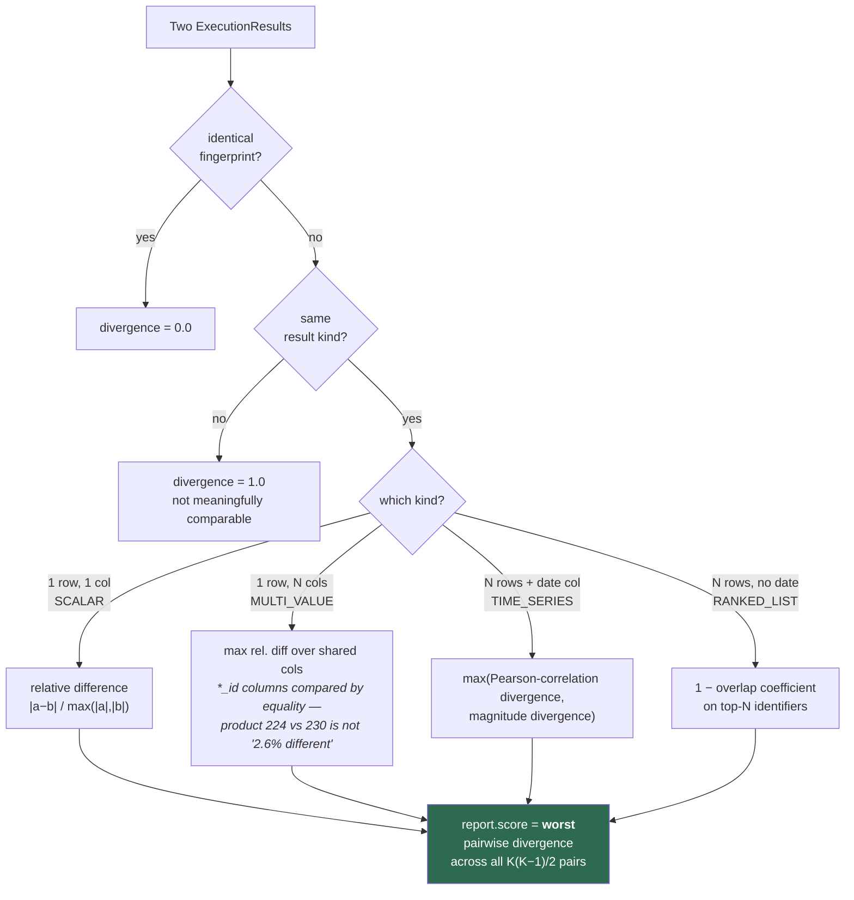
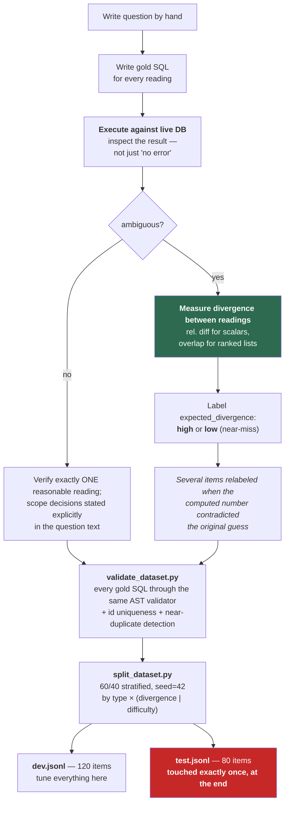
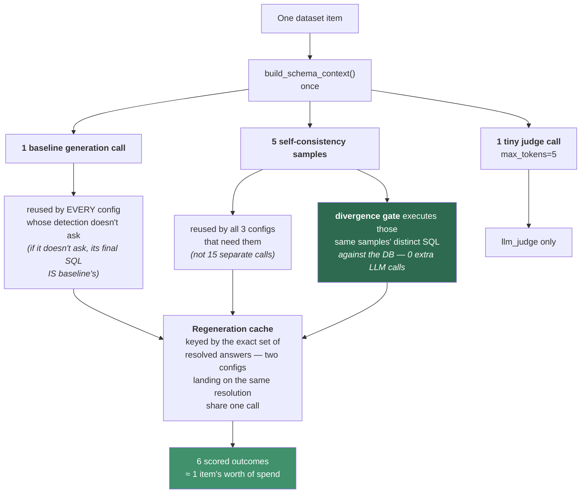
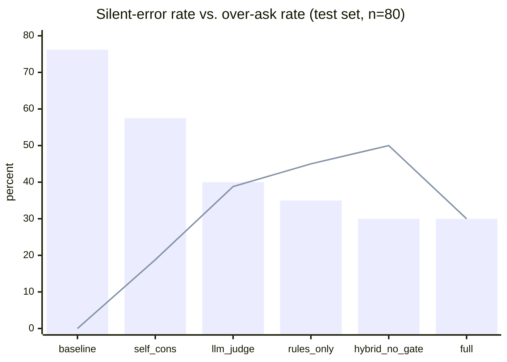

# Don't Ask Unless It Matters: Building a Text-to-SQL Clarification Engine

### Most text-to-SQL systems answer ambiguous questions confidently and wrongly. I built one that measures whether the ambiguity would actually change the answer before it decides to interrupt you — and then measured how often it gets that call right.

---

## The 30-second version

Ask a text-to-SQL system *"Who is our best customer?"* and it will answer. Confidently. With a real name and a real number.

Here is what happened when I asked exactly that against my seeded e-commerce database:

**Baseline system** (silently picks revenue): Michael Clarke, Christy Bolton, Charles Baker, Alex Nguyen, Monica Coleman — 9 to 16 orders each, $30K–$40K in revenue.

**Same system, after asking "which metric did you mean?" and being told "number of orders":** Michelle Phillips, Hunter Spencer, Christopher Mayer, Mary Hebert, Robert Brown — 43 to 45 orders each.

**Zero names in common.** Same question, same database, same data. A completely different answer hinging on one word nobody defined.

The baseline never mentioned that "best" was undefined. It just picked, and returned a formatted table that looks exactly like a correct answer.

I built a clarification layer to fix that, and evaluated it on a hand-built, held-out 80-question test set against five alternative strategies. The headline:

> **Baseline answered 95.1% of ambiguous questions confidently and wrongly** — no clarification, no disclosure, just a silently-wrong answer. **The full system reduced that to 22.0%, while interrupting the user on only 30.0% of all queries** (ambiguous and unambiguous combined).

This post walks through every part of how it's built and everything I measured, including the parts that didn't work.

---

## Part 0: Why "wrong answer" is the wrong problem

There are two ways a text-to-SQL system can fail, and they are not equally bad.

The first is a **loud failure**: the SQL doesn't run, the column doesn't exist, the number is obviously absurd. This gets caught. Somebody notices, files a bug, moves on.

The second is a **silent failure**: the query runs, the result is well-formed, the number is plausible, and it's answering a subtly different question than the one that was asked. This does not get caught. It gets pasted into a deck. It gets trusted, *precisely because* the system never signaled it was unsure.

The person reading the dashboard has no way to distinguish "I computed this confidently" from "I guessed, and I'm not going to mention that."

So I defined the metric this project actually targets:

**Silent-error rate** = fraction of all queries where the system was wrong *and* neither asked a question *nor* disclosed an assumption.

That's the number to drive down. Not raw accuracy — a wrong-but-disclosed answer is a fundamentally different failure than a wrong-and-confident one.

But there's an obvious cheat. A system that asks a clarifying question on every single query has a near-zero silent-error rate and is completely useless. Annoying systems get bypassed, ignored, or replaced — which lands you right back at silently-wrong-and-trusted, with extra steps.

So the real problem statement is a **two-sided optimization**:

> Reduce silent errors while asking as rarely as possible.

Which means the second metric matters just as much:

**Over-ask rate** = fraction of *all* queries (ambiguous or not) where the system interrupted the user.

Almost nobody publishes this number. It's the one that makes clarification systems look bad.

---

## Architecture at a glance

Here is the whole system, front to back.



The critical design constraint, visible in that diagram: **everything except the boxes that say "LLM" runs for free.** Retrieval, intent parsing, rule detection, the divergence gate, the policy engine, question rendering, AST validation — zero model calls. The only paid steps are baseline generation, the five self-consistency samples, and the post-clarification regeneration.

That's deliberate. A clarification layer that needs an expensive model call just to decide whether to ask a cheap question is solving the wrong problem.

---

## Part 1: A database designed to be ambiguous

You cannot study ambiguity on a clean schema. If every noun maps to exactly one table and every metric has exactly one definition, there's nothing to be ambiguous *about*. So the first thing I built was a deliberately messy — but entirely realistic — e-commerce schema where every design decision creates a specific, defensible ambiguity.



Every trap in there is intentional:

| Schema decision | The ambiguity it creates |
|---|---|
| `customers` and `users` are separate tables, 1-to-many | "How many customers?" → 5,000 or 7,589? |
| `orders.status` includes `cancelled` and `returned` | Does a cancelled order count as a sale? |
| `users.is_internal` | Do staff/test accounts belong in customer analytics? |
| `deleted_at` on `users` and `products` | Do discontinued products count in "how many products do we sell"? |
| `payments.currency` varies, unconverted | Summing `amount` across currencies is meaningless |
| `payments.status` includes `failed`/`pending` | Only `succeeded` is realized revenue |
| `refunds` as a separate fact table | Gross revenue vs. net revenue |
| `order_items.unit_price` vs `products.price` | Historical revenue vs. current list price |
| `orders` (header) vs `order_items` (line) | "Sales" = order count or unit count? |

### The seed generator

The data is synthetic but not random noise. `scripts/generate_seed.py` produces 18 months of history (2024-07-01 → 2025-12-31) with **~5,000 customers, 600 products, ~40,000 orders**, and — critically — traps that make ambiguity *measurable* rather than theoretical:

- **Customer archetypes.** Whales (2%), frequent-bargain buyers (5%), internal accounts (6 of them), and normal customers. Order *count* and order *value* are driven by independent traits, so **top-10-by-revenue and top-10-by-order-count are different customer pools**. That's what makes the "best customer" example at the top of this post have zero overlap — it isn't cherry-picked, it's constructed.
- **Independent engagement.** Session counts come from a third independent trait, so top-by-revenue and top-by-sessions also diverge.
- **A Black Friday spike** placed 2025-11-27 → 11-30 — *inside* the last calendar month before the data's end date, but *outside* the trailing-30-day window. This single placement is what makes "last month" genuinely ambiguous rather than pedantically ambiguous.
- **Price drift**, so `order_items.unit_price` and `products.price` diverge for older orders.
- **A refund rate** tuned to remove 5–15% of gross revenue, making gross-vs-net a real gap.

The whole generator is deterministic: one seeded `numpy` Generator, one seeded `Faker`. Re-running produces byte-identical output, so every verified number in the benchmark stays true.

### Security: two roles, enforced in code

Postgres runs in Docker with two roles created at init:

- `app_owner` — migrations and seeding only.
- `app_readonly` — `SELECT` only, `USAGE` on schema, **`statement_timeout = 5000`** set at the role level, no `CREATE` on `public`.

And then, because "we only use the readonly role" is the kind of claim that quietly stops being true:

```python
_RESTRICTED_PACKAGES = ("t2sql.generation", "t2sql.clarify")

@contextmanager
def get_connection(role: Role = "readonly"):
    if role == "owner":
        caller = _caller_module()
        if caller and caller.startswith(_RESTRICTED_PACKAGES):
            raise OwnerConnectionForbidden(
                f"{caller} may not request an owner connection; use role='readonly' instead"
            )
```

Any code in the generation or clarification packages that asks for an owner connection gets a stack-inspected refusal at runtime. Model-generated SQL cannot reach a writable connection, by construction — not by convention.

---

## Part 2: The semantic layer

Between the raw schema and the LLM sits a small YAML semantic layer, validated against the live database at load time. Four files:

**`entities.yaml`** — per table: description, grain, primary key, foreign keys, soft-delete column, enum values, and a per-column description.

**`joins.yaml`** — the join graph, as explicit edges. Used for retrieval bridge expansion (below), not just documentation.

**`defaults.yaml`** — the house rules. What the system assumes when the question doesn't say:

```yaml
result_shape:
  default_limit: 10
scope:
  exclude_internal_accounts: true
  exclude_soft_deleted: true
metric:
  revenue_default: revenue_net
temporal:
  anchor: max_order_created_at   # NOT wall-clock now()
  last_month: previous_calendar_month
always_disclose_defaults: true
```

That `anchor: max_order_created_at` line matters more than it looks. Anchoring "last month" to wall-clock `now()` would silently break every example in this project the moment real time moved past the seed window. Anchoring to the data keeps the Black Friday trap alive forever.

**`metrics.yaml`** — seven metrics, each with a self-contained SQL expression, a description, default filters, a grain, required joins, and a **deliberately overlapping synonym list**:

```yaml
revenue_net:
  sql_expression: >-
    COALESCE(SUM(payments.amount) FILTER (WHERE payments.status = 'succeeded'), 0)
    - COALESCE(SUM(refunds.amount), 0)
  synonyms: ["revenue", "sales", "net revenue", "best", "top", "most valuable", ...]
  default_filters: ["payments.currency = 'USD'"]
  grain: order

order_count:
  sql_expression: "COUNT(DISTINCT orders.id)"
  synonyms: ["number of orders", "order count", "best", "top", "most valuable", ...]
  default_filters: ["orders.status != 'cancelled'"]
  grain: order

session_count:
  sql_expression: "COUNT(DISTINCT sessions.id)"
  synonyms: ["visits", "sessions", "best", "top", "most active", "most valuable", ...]
  default_filters: []
  grain: session
```

**The overlap is the feature.** "best" appears in three metrics' synonym lists. When the intent parser matches a term against every metric whose synonyms contain it, "best" produces three candidates — and *that multi-candidate result is the ambiguity signal*. The ambiguity isn't detected by a special-purpose "is this vague?" heuristic; it falls out of the vocabulary structure itself.

There are four such overlap groups:

- `best` / `top` / `most valuable` / `biggest` → **revenue_net, order_count, session_count**
- `best seller` / `outselling` / `revenue driver` → **revenue_net, unit_count**
- `revenue` / `total revenue` → **revenue_gross, revenue_net**
- `popular` → **revenue_net, distinct_active_customers**

The loader validates two ways: pydantic model validators for internal consistency (no DB needed), and `validate_semantic_layer()` which checks that every table/column referenced by entities, joins, and metric `sql_expression`s actually exists in the connected database — and that every expression parses under sqlglot. The semantic layer cannot silently drift from the schema.

---

## Part 3: The baseline pipeline

Before you can measure a clarification engine, you need the thing it's an improvement over: a competent, ordinary text-to-SQL pipeline that makes silent choices.



### 3.1 — Retrieval that scales

Dumping the whole schema into every prompt works at 10 tables and stops working at 200. So each table gets one embedding, built from its description + grain + column descriptions, using `BAAI/bge-small-en-v1.5` (with the correct asymmetric query prefix — bge trains queries and passages differently), cached to disk.

One non-obvious addition: **metric synonyms get folded into table documents**. The `products` table's own description says nothing about revenue, so "who spent the most on electronics" wouldn't retrieve it. Folding in the synonyms of every metric that requires joining that table fixes the retrieval gap without touching the schema.

Then the part I'm happiest with: **join-graph bridge expansion**.

Cosine similarity might select `products` and `orders` for a question — but you cannot join those two tables directly. The bridge table `order_items` is semantically boring and will never score highly on similarity, yet without it the model has to hallucinate a join path.

```python
def _bridge_expand(selected, adjacency):
    """Add the minimal join-graph bridge tables so `selected` is connected."""
    while True:
        components = _connected_components(selected, adjacency)
        if len(components) <= 1:
            return selected
        start = next(iter(components[0]))
        other_nodes = set().union(*components[1:])
        path = _shortest_path(start, other_nodes, adjacency)
        if path is None:
            return selected
        selected |= set(path)
```

Find the connected components of the selection over the join graph; BFS the shortest path between them; add the path; repeat until connected. Retrieval selects what's *relevant*; the join graph adds what's *necessary*.

The rendered context is real DDL with `COMMENT ON` statements, grain/PK/FK notes, enum values, only the metrics whose expressions touch selected tables, and the house defaults.

### 3.2 — Generation

The system prompt is explicit about the baseline's job, which is to be *representative of a normal system*, not to be good at clarification:

> *"Ambiguity is expected and NOT something to ask about here — there is no user to ask. Silently resolve every ambiguous choice using the house defaults given in the schema context. Record every such choice you made as one short, plain-English sentence in `assumptions`."*

Output is structured (pydantic, via OpenAI-compatible structured output on OpenRouter):

```python
class GeneratedSQL(BaseModel):
    sql: str
    tables_used: list[str]
    assumptions: list[str]
    confidence: float = Field(ge=0.0, le=1.0)
```

Capturing `assumptions` from the baseline is itself informative — it shows exactly what the model silently decided, which is the raw material of a silent error.

Every single call is logged as JSONL with prompt/completion tokens, latency, and **OpenRouter's own reported `cost`** — real dollars billed, not an estimate from a guessed per-token rate. That trace file becomes load-bearing later (see the budget guard).

One practical note baked into the code: most OpenRouter-backed models silently ignore the OpenAI `n` parameter and return a single choice, so `n > 1` issues `n` independent calls instead. That's the self-consistency detector's whole cost profile in one line.

### 3.3 — AST validation

Before any SQL touches the database, `validate_sql()` parses it with sqlglot and rejects, with a specific typed error per problem:

| Error type | What it catches |
|---|---|
| `PARSE_ERROR` | Unparseable string |
| `MULTIPLE_STATEMENTS` | Statement stacking |
| `NOT_A_SELECT` | DML/DDL at the root |
| `FORBIDDEN_STATEMENT` | `INSERT`/`UPDATE`/`DELETE`/`DROP`/`GRANT`/`COPY`/… anywhere in the tree, **including inside a CTE** |
| `CATALOG_ACCESS` | `pg_*` tables, `information_schema` |
| `UNKNOWN_TABLE` | Table not in the live schema |
| `UNKNOWN_COLUMN` | Hallucinated column (via sqlglot's `qualify` optimizer against a live `MappingSchema`) |
| `WIDE_SELECT_STAR` | `SELECT *` on a table with >20 columns |
| `CARTESIAN_PRODUCT` | A join — comma-joins included — with no `ON`/`USING` |

On success it doesn't just approve, it **rewrites**: fully qualifies every column reference (resolving aliases, raising precisely on anything unresolvable) and **injects `LIMIT 1000` if none is present**.

The unknown-column check is the one that earns its keep. Hallucinated columns are the canonical failure mode for this kind of pipeline, and the right place to catch one is against the live schema — not in the database error it eventually causes. (Foreshadowing: this validator caught a real hallucination during the test run, and the *harness around it* threw the result away. More on that in the failure analysis.)

### 3.4 — Execution and repair

`execute()` runs against `app_readonly`, sets `statement_timeout` server-side per call (on top of the role-level default), caps rows pulled into the payload, and **never raises** — it always returns a structured `ExecutionResult` describing what happened, including `timed_out` as a distinct state.

The repair loop treats a validation failure and a real DB error identically — both are just *"here's what was wrong, try again"* — and shares one `max_repairs` budget. A **timeout is treated differently**: regenerating the SQL can't fix a query that's too slow, so it short-circuits immediately rather than burning a repair attempt on something that structurally cannot succeed.

---

## Part 4: The ambiguity taxonomy

Here's the first thing I got wrong and had to back out of: **"detect ambiguity" is not one problem.**

"Who is our best customer" and "how many orders came in last month" are both ambiguous, in completely unrelated ways. A system that treats them the same — one keyword list, one threshold, one kind of clarifying question — does badly at both.

So before writing any detection code, I catalogued the specific, concrete ways a question against *this* schema admits more than one defensible reading. Seven types showed up repeatedly across a hundred hand-written ambiguous questions. Each is encoded in `taxonomy.py` with a description, detection hints, and a default policy — and each has a worked example with real SQL and **real executed numbers**, not asserted ones.



The verified numbers, all executed against the live seed data:

| Type | Question | Reading A | Reading B | Gap |
|---|---|---|---|---|
| **METRIC** | "Who is our best customer?" | net revenue → customer **1333** ($38,722) | order count → customer **3000** (319 orders) | Different entity entirely |
| **TEMPORAL** | "How many orders last month?" | calendar Nov 2025 → **4,361** | trailing 30d → **2,503** | 74% — the Black Friday spike |
| **ENTITY** | "How many customers do we have?" | `customers` → **5,000** | active non-internal `users` → **7,589** | 52% |
| **SCOPE** | "How many orders have we had?" | all statuses → **40,341** | excl. cancelled → **37,531** | 2,810 orders |
| **GRAIN** | "What's our average order value?" | per-order → **$192.31** | per-customer → **$1,452.35** | 7.5× — a different quantity |
| **COMPARISON** | "Which category is growing fastest?" | MoM → Books **−32.0%** | vs 6-mo avg → Books **+3.5%** | **The sign flips** |
| **RESULT_SHAPE** | "Show me our top customers" | `LIMIT 5` | `LIMIT 10` | Literally different result sets |

The COMPARISON row is my favorite. Same category, same data, same question — and one reading says the business is shrinking while the other says it's growing. Not a rounding difference. Opposite answers.

This groundwork mattered more than any individual piece of detection logic downstream. It's the difference between *"ask a model if this is ambiguous"* — which conflates seven distinct problems into one vague judgment call — and having **seven specific, checkable hypotheses** about what could be wrong with a given question.

---

## Part 5: The clarification engine

Five components, in the order a question passes through them.



### 5.1 — Intent parsing: ambiguity as a parse result

`parse_intent()` decomposes a question into seven slots — `metric`, `entity`, `dimensions`, `filters`, `time_range`, `limit`, `sort` — resolving each against the semantic layer's vocabulary with the same three-way rule:

```python
def _resolve(candidates, empty_reason, multi_reason=None):
    if len(candidates) == 1:
        return Slot(candidates=candidates, resolved=candidates[0])
    if not candidates:
        return Slot(candidates=[], resolved=None, reason=empty_reason)
    return Slot(candidates=candidates, resolved=None, reason=multi_reason or ...)
```

**"2+ candidates → unresolved" is deliberate, not a bug.** It's exactly how "best" surfaces `candidates=[revenue_net, order_count, session_count]`. The multiple matches *are* the signal.

`time_range` uses an ordered phrase table — "last month" → `[calendar_month, trailing_30_days]`, "recently" → `[trailing_7_days, trailing_30_days]` — so a temporal phrase with two common readings arrives already carrying both.

`limit` distinguishes three states that matter downstream: an explicit count ("top 5"), **ranking language with no count** (the RESULT_SHAPE signal), and no ranking language at all.

### 5.2 — The rule detector: seven rules, precision-first

One rule per taxonomy type, over the parsed `Intent`. The explicit design bar here was **precision, not recall** — recall is what the next mechanism is for.

| Rule | Fires when | Confidence |
|---|---|---|
| ENTITY | 2+ entity candidates, restricted to pairs that genuinely differ in grain | 0.90 |
| METRIC | 2+ metric candidates matched | 0.85 |
| TEMPORAL | `time_range` has 2+ common readings | 0.85 |
| GRAIN | a matched metric is an *averaging* metric (has `/` in its expression, or "average"/"avg" in its synonyms) | 0.75 |
| RESULT_SHAPE | ranking language, no explicit row count | 0.70 |
| COMPARISON | a trend word with no stated baseline | 0.60 |
| SCOPE | a matched metric carries `default_filters` and the question states no scope language | 0.50 |

The interesting parts are the **negative** rules — the ones that suppress a firing:

```python
DIFFERENT_GRAIN_ENTITY_PAIRS = frozenset({frozenset({"customers", "users"})})
```

Not derived generically from the schema (e.g. "any two FK-linked tables"), because that over-fires: `products` and `categories` are FK-linked too, but nobody confuses them the way "customer" is confused with "user account".

```python
EXPLICIT_METRIC_DEFINITION_TERMS = [
    "using ", "unit price", " by number of", " by total", " by delivered",
    "gap between", "difference between", "order count", "address count",
]
```

If the question already spells out its own ranking basis ("top customers **by number of orders**"), a superlative word like "top" isn't really METRIC-ambiguous. The confidence numbers are honestly labelled in the source: *"Not empirically calibrated to a probability scale — just a fixed per-rule strength ranking."* They exist so the policy engine can prefer a stronger signal over a weaker one, nothing more.

### 5.3 — Self-consistency: asking the model if it agrees with itself

The rule detector can only catch ambiguity somebody wrote a keyword list for. The second mechanism needs no keyword list at all: **generate five candidate SQL queries at temperature 0.8 and check whether the model agrees with itself.** If it doesn't, that disagreement is a signal, independent of any hand-written rule.

The hard part is *comparing* the candidates. Raw SQL text comparison is useless — two queries that compute the identical thing routinely pick different aliases and different output column names. So each candidate is parsed into a **semantic signature**:

```python
@dataclass(frozen=True)
class QuerySignature:
    tables: frozenset[str]
    select_exprs: tuple[str, ...]
    group_by: tuple[str, ...]
    where_predicates: frozenset[str]
    order_by: tuple[str, ...]
    limit: int | None
```

Two normalizations were found and fixed during calibration, and both removed a lot of pure noise:

1. **Table-alias canonicalization** — rewrite every alias reference to the real table name and strip `SELECT`-list aliases, so `s`/`u` vs `sessions`/`users` and `total_sessions` vs `session_count` stop reading as semantic differences.
2. **CTE-name exclusion** — sqlglot's `exp.Table` matches CTE references too, so two candidates computing the identical thing via differently-named CTEs looked like they used *entirely different tables*.

Then: cluster identical signatures, and

> **divergence score = 1 − (largest cluster size / N)**

Five identical queries → 0.0. Five all-different → 0.8. Unparseable candidates count as their own cluster — a parse failure is real evidence of instability, not something to silently skip.

`_infer_type()` then guesses *which* taxonomy axis the disagreement is on, from which signature component actually varies: differing `tables` → ENTITY, differing `select_exprs` → METRIC, differing `group_by` → GRAIN, differing `where_predicates` → TEMPORAL if they contain date literals or `interval`, else SCOPE.

**Calibration, done honestly on the dev set.** A dedicated script (`scripts/tune_self_consistency_threshold.py`) ran all 13 dev ambiguous items the rules missed, plus all 61 dev unambiguous items — 74 items, N=5:

| threshold | caught (of 13) | false-fire (of 61) |
|---|---|---|
| 0.4 / 0.5 | 4 | 13 (21.3%) |
| 0.6 / 0.7 | 2 | 5 (8.2%) |

My own written target had been "≥5 caught, ≤15% false-fire." **No single threshold met it.** Rather than move the goalposts quietly, I picked 0.6 — keeping false-firing well under the ceiling at the cost of missing the recall bar — and wrote the failure into the module docstring where the next person reading the code will see it. Over-asking is the failure mode this project exists to avoid; when forced to choose, I chose precision.

### 5.4 — The divergence gate: the idea the whole project rests on

Here's the core insight:

> **Don't ask because a question looks ambiguous. Ask because two plausible readings of it would give visibly different answers.**

If "average order value" could mean per-order or per-customer, and on your data those are $47.20 and $47.80, nobody needs to be interrupted. If they're $192 and $1,452 — as they actually are here — that's a real fork in the road.

The mechanism is almost embarrassingly simple once you see it: take the candidate SQL for the different readings, **actually execute them**, and compare the *results*. Not the SQL text. The rows.

The subtlety is that "how different are these two results" means something different for every result shape, so the comparator is dispatched on a classified result kind:



Three details worth pulling out, because each one is a bug I would otherwise have shipped:

**Identifier columns are labels, not quantities.** Comparing product `224` against product `230` numerically gives "2.6% different." They aren't 2.6% different — they're *different products*. Any column named `id` or ending in `_id` is compared by equality, never by numeric distance.

**The ranked-list measure is an overlap coefficient, not Jaccard.** Jaccard mishandles the canonical near-miss shape: top-5 vs top-10 of an *identical* ranking gives 5/10 = 0.5, i.e. "50% different," treating five extra low-ranked rows as just as significant as a completely different leaderboard. Dividing by the *smaller* set instead of the union makes an exact prefix match score 1.0 — while two same-length, half-overlapping lists still score 0.5, exactly as Jaccard would. I tried a full positionally-weighted RBO first and dropped it: the textbook extrapolated formula is easy to get subtly wrong (an early version scored *identical* lists above 1.0), and the simpler measure gives the exact property this dataset needs without that risk.

**The overall score is the worst pair, not the average.** One genuinely different pair among K readings is reason enough to consider asking. Averaging would let three convergent readings drown out the one that matters.

Results are cached by a SHA-256 of the SQL text, not by the question — since the SQL text alone fully determines the result on a static database, hashing SQL is a strict refinement of hashing `(question, interpretation)`: more cache hits, same correctness. And `max_k=4` caps how many candidates get executed.

This is the piece I'd defend hardest. It's the one that distinguishes *"ambiguous"* from *"ambiguous **and consequential**"* — and only the second kind is worth a human's attention. It's also nearly free: once candidate SQL exists, comparing results is a handful of read-only queries, not another model call.

### 5.5 — The policy engine: a pure function

`decide_clarification()` takes detected ambiguities, an optional divergence report, session state, and config — and returns a decision. **No LLM call, no DB query, no mutation of anything passed in.** Seven documented rules, each with its own unit test:

1. Never ask when divergence is below threshold — default and disclose.
2. At most one clarification question per call.
3. Multiple ambiguous slots → ask about the highest-confidence one, default the rest.
4. Never re-ask a slot already resolved in this session.
5. An ASK decision's options **always** include an escape hatch: `"(just use a sensible default)"`.
6. Hard budget: at `max_clarifications_per_session = 2`, default everything, no matter how high the divergence.
7. Every defaulted slot lands in both `defaults_applied` and `disclosure_text` — **never silent**.

Rule 6 is the one that keeps the system usable. A system that keeps asking is failing in a different way than a system that never asks, and the failure is just as real.

There's also an honest simplification recorded right in the config:

```python
class PolicyConfig(BaseModel):
    # Compared against divergence_report.score when given, else against the
    # top pending ambiguity's own `confidence` -- both are nominally [0,1],
    # but a rule confidence and a measured result divergence aren't the same
    # kind of number. Documented simplification, not a claim they're equivalent.
    divergence_threshold: float = 0.3
    max_clarifications_per_session: int = 2
```

When the divergence gate produced a report, the threshold compares against a *measured* quantity. When it didn't, it falls back to a *hand-assigned rule confidence*. Those are not the same kind of number living on the same scale, and pretending otherwise would be the kind of thing that quietly makes an ablation table meaningless. It's flagged in the source rather than hidden. (It also turns out to be exactly where a real failure hides — see the failure analysis.)

Also note rule 3's dedupe step: the rule detector and self-consistency can both flag the same slot independently, and asking about it twice — or defaulting it twice with two different resolvers — makes no sense, so the highest-confidence detection per slot wins.

### 5.6 — Asking a question worth answering

A clarifying question that just says *"Your question is ambiguous, please rephrase"* is worse than useless. The target shape:

> *"Revenue (total spend), number of orders, or number of visits? Revenue and order count give quite different top-10 lists here — only 3 customers appear in both."*

Two sentences, two jobs. The first lists the readings in plain language, via small hand-curated label maps (`revenue_net` → "revenue (net of refunds)", `per_customer` → "per customer, averaged across each customer's own total"). The second — the important one — is generated **from the actual `DivergenceReport`**: for a ranked list, the real overlap count; for a scalar, the two real values.

The renderer is entirely template-based and deterministic. **No LLM call.** Concreteness, not fluency, is the point: the user isn't being asked to adjudicate a linguistic question, they're being shown that two answers genuinely differ and asked which one they want.

### 5.7 — Session state and follow-ups

`Session` carries resolved slots, clarification count, question/answer history, and applied defaults across turns. `process_turn()` ties everything together for one turn: parse → detect → decide → render if asking → record.

The follow-up rule is worth stating precisely, because the naive version is wrong:

```python
def effective_value(self, slot, intent_slot):
    """This turn's own resolution if it has one, else what the session resolved earlier."""
    if intent_slot.resolved is not None:
        return intent_slot.resolved
    return self.resolved_slots.get(slot)
```

The *current* question always wins. An earlier resolution only fills a slot this question is silent on. So "now show me the month before" inherits the metric you already clarified — but a follow-up that *does* re-specify a slot overrides the earlier answer instead of being shadowed by it.

---

## Part 6: The benchmark

None of the above means anything without a number attached, and a number is only as good as the dataset under it. So: **200 hand-constructed, hand-verified questions** — 100 unambiguous, 100 ambiguous — against the seeded schema.



Every item was verified against the live database. No gold SQL was accepted on the strength of "looks right." For ambiguous items, **every interpretation's result was computed and its divergence measured before the label was assigned** — and several items got relabeled when the computed number contradicted my original guess. My favorite: "average refund amount" was assumed to split like AOV does (per-order vs per-customer, a large gap) and turned out **exactly identical**, because no order in this seed data has more than one refund row.

### The near-miss items

27 of the 100 ambiguous items are **deliberate near-misses**: phrasing that *looks* ambiguous but whose interpretations converge on essentially the same answer. These are the items that make the over-ask metric meaningful — they're specifically designed to catch a system triggering on superficial ambiguity.

Verified examples:

- *"What's our average order value for the past month?"* — calendar-month vs trailing-30-day AOV differ by only **4.7%**, even though the underlying order and revenue totals differ by 40%+ (both shrink together).
- *"What's the average refund amount?"* — per-refund-row and per-refunded-order averages are **exactly identical**.
- *"How many customers are marked internal or staff accounts?"* — customer-grain and user-grain counts happen to coincide (6 internal logins across 6 distinct customers).
- *"Has the Electronics category grown this year?"* — H1-vs-H2 and Q1-vs-Q4 agree on the **sign** even though the exact percentage differs.

### Test-set discipline

This one is written into the dataset documentation so it's checkable rather than merely claimed:

> **`data/test.jsonl` is touched exactly once, at the final evaluation, and never again.** Every detector threshold, every prompt, every policy rule is tuned against `dev.jsonl` only.

The split is deterministic (`random.Random(42)`), stratified by ambiguity type — the 7 types plus `UNAMBIGUOUS` — and *sub*-stratified by a secondary key (`expected_divergence` for ambiguous items, `difficulty` for unambiguous ones), so near-misses and difficulty levels spread proportionally too. Re-running the script is a no-op.

**Distribution:**

| Type | dev | test | total | | Difficulty (unamb.) | dev | test | total |
|---|---|---|---|---|---|---|---|---|
| UNAMBIGUOUS | 61 | 39 | 100 | | single_table | 18 | 12 | 30 |
| METRIC | 10 | 6 | 16 | | one_join | 26 | 17 | 43 |
| COMPARISON | 9 | 7 | 16 | | multi_join | 6 | 4 | 10 |
| TEMPORAL | 9 | 6 | 15 | | window | 4 | 2 | 6 |
| SCOPE | 8 | 6 | 14 | | subquery_cte | 7 | 4 | 11 |
| GRAIN | 8 | 6 | 14 | | | | | |
| ENTITY | 8 | 5 | 13 | | **`expected_divergence`** | dev | test | total |
| RESULT_SHAPE | 7 | 5 | 12 | | high | 44 | 29 | 73 |
| **Total** | **120** | **80** | **200** | | low (near-miss) | 15 | 12 | 27 |

And the limitations, stated up front rather than discovered by a reader:

- **Ambiguity-type tagging is single-annotator.** All 200 items typed by one pass of my judgment. Inter-annotator agreement was not measured — a real limitation for a benchmark whose central claim is about *when a question is ambiguous*.
- **`expected_divergence` is a prediction, not ground truth.** It's exactly what the divergence gate exists to validate or refute. The 73/27 split is a hypothesis being tested, not an established fact.
- **Near-duplicate detection is lexical, not semantic** — it would miss a genuine paraphrase.
- **All 200 questions are English and single-turn.**

---

## Part 7: The evaluation harness

### Metrics, defined precisely

Everything is a pure function over a list of `EvalRecord`, so a unit test can hand-construct records with a known answer.

```python
class EvalRecord(BaseModel):
    id: str
    is_ambiguous: bool                 # gold label
    expected_divergence: Literal["high","low"] | None
    detected_ambiguous: bool           # raw detection signal, pre-policy
    asked: bool                        # actually surfaced a question
    disclosed: bool                    # flagged uncertainty without asking
    correct: bool                      # final SQL matched gold
```

- **Execution accuracy** runs predicted *and* gold SQL and compares **result sets, never SQL strings** — semantically identical queries can look nothing alike. Order-insensitive unless the gold query has a top-level `ORDER BY`; tolerant of float rounding to 6 decimals. A prediction is correct if it matches **any** gold interpretation, since `gold_sql` is a list precisely because an ambiguous question has several equally-valid readings.
- **Silent-error rate** — wrong AND didn't ask AND didn't disclose. The headline.
- **Over-ask rate** — asked, over *all* queries.
- **Unnecessary-ask rate** — of the known near-miss items, what fraction got asked about anyway. The denominator is fixed to that subset rather than "all asks" so the rate stays well-defined even when the system never asks.
- **Detection P/R/F1** of `detected_ambiguous` against the gold `is_ambiguous` label.
- **Bootstrap CIs** — percentile bootstrap, generic over any of the rate functions above. At n=80, the error bars matter, and reporting a point estimate alone would be misleading.

### The simulated user

To run 80 items × 6 configs unattended, the human side of the loop is automated: pick one gold interpretation as the item's **hidden true intent**, then answer every ASK from that hidden intent *alone* — never from the question text, never from another interpretation.

Matching a hidden interpretation's label to one of the offered options isn't always a literal string match, so `_choose_option` tries three strategies in descending confidence:

1. Exact match against the compound label.
2. The candidate's underscore-split tokens appear as a contiguous run inside the label's tokens (catches `revenue_net` inside `revenue_net_excl_internal`).
3. Token overlap between each candidate's *humanized* text and the interpretation's free-text `clarification_answer` (catches `calendar_q4` vs `calendar_quarter`, which share no substring but share words once humanized).

If none produces an unambiguous winner, that's **recorded as `clarification_missed_target`** — a real failure mode (the offered options didn't contain the truth) reported alongside accuracy, not papered over. That recording is what surfaced the RESULT_SHAPE bug later.

There are also two adversarial strategies for robustness: `ALWAYS_DEFAULT` (always takes the escape hatch) and `VAGUE` (answers with a random offered option).

### The budget guard

Every LLM call already logs OpenRouter's own reported `cost` to a JSONL trace. `BudgetGuard` tails that same file:

```python
def check(self):
    self.refresh()   # re-sum every trace line appended since this guard was created
    if self.spent_usd >= self.ceiling_usd:
        raise BudgetExceeded(self.spent_usd, self.ceiling_usd)
```

Called before *every* real LLM call. A run that hits the ceiling stops cleanly with whatever items it already scored, rather than continuing over budget. Real billed dollars, not an estimate from a guessed per-token rate. This project ran on a few dollars of credit total; that constraint shaped real design decisions, and I'd rather have it enforced by code than by hope.

### Six configs, sharing every call they can

The ablation runs six configurations over the same dataset:

| Config | Detection mechanism |
|---|---|
| `baseline` | none at all |
| `llm_judge` | one "is this ambiguous?" LLM call (the thing most people build first) |
| `rules_only` | the free rule detector |
| `self_consistency_only` | N=5 sampling |
| `hybrid_no_gate` | rules + self-consistency |
| `full` | rules + self-consistency + **the divergence gate** |

Running these naively would cost 6× per item. Instead the runner shares every genuinely identical call:



One concrete measured effect: across the 80 test items, only **27 actual regeneration calls** were needed in total. A naive per-config accounting would have suggested up to 75 were "needed"; caching identical resolutions across configs cut it to about a third of that.

---

## Results

**Held-out test set, 80 items (41 ambiguous, 39 unambiguous). Run exactly once.**
Model: `anthropic/claude-haiku-4.5` for **every** config, `baseline` included. Self-consistency N=5. Total spend: **$2.1498** of a $2.50 ceiling.

### The ablation table

| config | correctness | over-ask rate | unnecessary-ask | detection P/R/F1 | **silent-error rate** | est. cost/query | est. latency/query |
|---|---|---|---|---|---|---|---|
| baseline | 23.8% | 0.0% | 0.0% | 0.00/0.00/0.00 | **76.2%** | $0.0042 | ~3.8s |
| llm_judge | 25.0% | 38.8% | 66.7% | 0.71/0.95/0.81 | 40.0% | $0.0055 | ~5.8s |
| rules_only | 25.0% | 45.0% | 66.7% | 0.83/0.73/0.78 | 35.0% | $0.0054 | ~4.8s |
| self_consistency_only | 23.8% | 18.8% | 8.3% | 0.73/0.27/0.39 | 57.5% | $0.0254 | ~22.6s |
| hybrid_no_gate | 25.0% | 50.0% | 66.7% | 0.78/0.76/0.77 | 30.0% | $0.0266 | ~23.6s |
| **full** | 23.8% | **30.0%** | 50.0% | 0.78/0.76/0.77 | **30.0%** | $0.0260 | ~23.1s |

Three things to read out of that table.

**1. The headline.** Restricted to ambiguous questions, baseline answered **95.1% of them confidently and wrongly**. `full` reduced that to **22.0%**. Across all 80 items, silent-error rate falls from 76.2% to 30.0% — while asking on only 30% of all queries.

**2. The load-bearing row is `full` vs `hybrid_no_gate`.** Identical detection signal feeding both. The divergence gate cuts over-asking from **50.0% → 30.0% with zero silent-error cost** (30.0% either way). Same catches, 40% fewer interruptions. That's the gate doing exactly the job it was built for — not a marginal improvement, a structural one. And it does it with **no LLM call at all**.

**3. Correctness barely moves anywhere.** ~24% across every config. That's a budget artifact, and I'd rather name it than bury it — see Limitations. The thing this project targets is silent, undisclosed wrongness, not generation quality, and on *that* axis the effect is large and real.



*Bars = silent-error rate (lower is better). Line = over-ask rate (lower is better). `full` is the only config that gets both down at once — same silent-error rate as `hybrid_no_gate`, at 40% less interruption.*

### Confidence intervals (bootstrap, 2000 resamples, seed=0)

| config | metric | point | 95% CI |
|---|---|---|---|
| baseline | correctness | 23.8% | [15.0%, 33.8%] |
| baseline | over-ask rate | 0.0% | [0.0%, 0.0%] |
| baseline | silent-error rate | 76.2% | **[66.2%, 85.0%]** |
| full | correctness | 23.8% | [15.0%, 33.8%] |
| full | over-ask rate | 30.0% | [20.0%, 40.0%] |
| full | silent-error rate | 30.0% | **[20.0%, 41.2%]** |

At n=80, the silent-error intervals **do not overlap at all** — baseline's lower bound (66.2%) sits well above full's upper bound (41.2%). The headline effect is comfortably outside noise.

The correctness intervals, meanwhile, are wide and *identical* for both configs — exactly what you'd expect if correctness is dominated by the shared generator rather than by which config is asking. The CIs corroborate the story rather than just decorating it.

### Per-ambiguity-type breakdown (`full` vs `baseline`)

| type | n | full: correct | full: over-ask | full: silent-error | baseline: silent-error |
|---|---|---|---|---|---|
| METRIC | 6 | 0.0% | 50.0% | **0.0%** | 100.0% |
| TEMPORAL | 8 | 0.0% | 25.0% | **0.0%** | 100.0% |
| ENTITY | 5 | 0.0% | 0.0% | 20.0% | 100.0% |
| SCOPE | 8 | 25.0% | 37.5% | 37.5% | 75.0% |
| **GRAIN** | 7 | 0.0% | **0.0%** | **71.4%** | 100.0% |
| COMPARISON | 7 | 0.0% | 100.0% | **0.0%** | 100.0% |
| RESULT_SHAPE | 6 | 0.0% | 83.3% | **0.0%** | 100.0% |

This table is where the aggregate number stops being flattering and starts being useful.

**GRAIN is the systematic failure.** A 0% over-ask rate means the detector essentially *never* flags it — so its silent-error rate (71.4%) barely improves on baseline's 100%. Whatever the aggregate says, this ambiguity type is not being handled.

**COMPARISON and RESULT_SHAPE sit at the opposite extreme** — asked about on nearly every item of that type. That's *why* their silent-error rate hits zero, and also why they dominate the over-ask rate. Their zeros are bought with interruptions, not with intelligence.

### Cost and latency

Real measured totals for the run: **$2.1498**, **587 real LLM calls** (507 generation + 80 tiny judge calls), over **~46 minutes** wall-clock. Real per-call averages: generation = **$0.00424 / 3.77s**; judge = **$0.00011 / 0.97s**.

Because most calls are shared across configs, that $2.15 is the cost of running *all six configs together*, not any one alone. The per-query columns in the table answer the question that matters for a deployment decision — "what would running just this config cost per query" — by applying the same real per-call-type averages to each config's own known call count.

> **Overhead of `full` over `baseline`: ≈$0.022 and ≈19s per query — about 6× on both axes, driven almost entirely by the 5 self-consistency samples.** The judge call and rule detection are effectively free (~$0.0001 and $0). The divergence gate itself is free of LLM cost entirely.

That's an actionable finding, not just an accounting one: **any attempt to cut this system's cost should target N first**, not the gate.

**What this is not:** per-query token counts, DB-query counts, and p50/p95 latency were never instrumented at the per-item level in this run — only run-level totals and per-call-type averages. So the cost/latency columns are a **structural estimate from known call-count architecture**, grounded in real per-call costs, not measured per-query data. There's no percentile to report because there's only one number per config. Adding real per-item instrumentation would mean re-running — and touching the test set a third time — which isn't worth it for an instrumentation detail.

### Three worked examples

**1. A disclosure win, not a correctness win.** *"How much revenue have we made?"* — `baseline` and `full` produce **byte-identical SQL**. The difference is entirely in what the user sees: baseline picked net-of-refunds silently; `full` detected the SCOPE ambiguity, asked, got "net revenue" back, and **disclosed the choice explicitly** before answering. Same answer — but the user now knows what was assumed instead of finding out the hard way three weeks later. This is the actual value proposition, and it shows up even when generation quality doesn't improve at all.

**2. An "unnecessary" ask with a real side effect.** *"List our best-selling products."* — this item's only labeled ambiguity is RESULT_SHAPE, annotated `expected_divergence: low`. `full` asked anyway, and after folding the answer into a second generation call came back with a **different ranking metric entirely**: baseline ranked by units sold, the regenerated query ranked by net revenue, unprompted. An ask that was "supposed" to be harmless destabilized a part of the query nobody asked about — purely because a second, independent LLM call doesn't reliably reproduce the first one's other choices. **That's a real cost of regeneration-based clarification beyond user annoyance**, and it belongs on the scale against the disclosure benefit above.

**3. A genuine detection miss.** *"What's the average number of sessions per user?"* — the intended reading is the average *among users who ever had a session*. Both baseline and `full` silently average over *all* users (a `LEFT JOIN` keeps zero-session users in the denominator), and `full` never flags it as ambiguous at all. This is the GRAIN weak spot: none of the three mechanisms reliably catch "which rows are in scope for an average," so this class of error stays **fully silent even with the whole system engaged**.

---

## Part 8: Failure analysis — reading every single miss

Aggregate metrics tell you *that* something is wrong. They never tell you *what*. So after the test run I went through the raw per-item output and categorized every failure. Everything below is a real count, not a hand-picked anecdote.

### Detection misses: 10 of 41 ambiguous items (24%) get no signal at all

| type | misses / total | |
|---|---|---|
| GRAIN | 5 / 7 | **71%** |
| SCOPE | 4 / 8 | 50% |
| ENTITY | 1 / 5 | 20% |

**GRAIN is the systematic gap, and the root cause is precise.** All five misses are "average X per Y" questions — *"average number of sessions per user," "average refund amount," "average customer lifetime value"* — and the rule detector's hints only fire on an explicit "per X" phrase. **None of these five questions contain the word "per" at all.** The grain ambiguity is implicit in what an *average is* (per order? per customer? per engaged user, excluding zeros?), not signaled by any keyword.

That's a detection-strategy gap, not a semantic-layer gap: `metrics.yaml` doesn't need to change. The rule needs to fire on *"an aggregate function with no stated denominator,"* not on a literal "per" token.

**SCOPE misses are the inverse problem.** The hints list explicit scope words ("cancelled," "refund," "internal," "deleted"), so a question mentioning none of them never fires — correctly, in isolation. But three of the four misses are catalog-count questions (*"how many products do we sell"*) where **the absence of a stated scope is itself the ambiguity** (include discontinued products or not?), and nothing about that absence is lexically distinguishable from a genuinely unambiguous question. Self-consistency is supposed to catch what rules miss here — but its own recall is low, so these items fall through both mechanisms.

### Over-asks that survived the gate

**Near-miss items asked anyway: 6 of 12.** Four of the six are COMPARISON or RESULT_SHAPE questions where the rule confidence (0.70–0.85) sits well above the 0.30 threshold *regardless of what the data shows*.

Here's the mechanism, and it's the most interesting bug in the project:

> The gate only intervenes when a `DivergenceReport` is actually computed. For `full`, that only happens when self-consistency's samples produce **2+ distinct SQL variants** to compare. When self-consistency **converges** on a single candidate, there's nothing for the gate to veto with — so it silently falls back to rule confidence alone.

Which means: the exact scenario the gate exists to prevent slips through *because its own input was empty*. And note the perverse logic — "the model agreed with itself five times out of five" is treated as **no information**, when it's actually strong evidence *against* asking. Zero disagreement should push the gate toward declining to ask, not hand the decision to an unrelated signal.

**Genuinely unambiguous items asked anyway: 6 of 39 (15%).** Spot-checking *"How many orders have been delivered?"*: the SCOPE rule has no positive check for "the question already states a fully-specific status filter." The hints are pure keyword presence/absence, so a status word that isn't one of the specific scope keywords still reads as "no explicit scope filter on a table with a documented default," and fires anyway. **The rule is checking for the absence of specific words, not the presence of an answer.**

### The validator caught it; the harness threw it away

Only 1 of 39 unambiguous items produced a hard execution error: `column o.deleted_at does not exist` — a hallucinated column. It's worth more than its count suggests, because of *where* it went wrong.

**The AST validator caught it.** `validate_sql` returned `ok=False` on the raw generated SQL, exactly as designed. The gap is entirely downstream: the *ablation harness*, unlike the production path, has no repair step — on a validation failure it falls back to the original, still-broken SQL rather than retrying with the validator's error fed back to the model.

The validator did its job. The harness around it didn't use the result. A real deployment (which does call the repair loop) would not show this failure; an ablation harness that's supposed to approximate one probably should. **The fix already exists in the codebase — it's just not called from the eval path.**

### When the offered options didn't contain the truth

Recomputed deterministically at $0 cost: of the 36 test items where rule-based detection decides to ask, 13 offer no option matching the item's real hidden answer. Filtering out the 6 that were unambiguous to begin with leaves **6 genuine misses**, in two flavors:

**Structurally empty candidate lists.** Both are RESULT_SHAPE, and the rule detector's `DetectedAmbiguity` for RESULT_SHAPE **never populates `candidates` at all**:

```python
def _detect_result_shape(intent):
    ...
    return DetectedAmbiguity(
        type=AmbiguityType.RESULT_SHAPE,
        slot="limit",
        candidates=[],          # <-- nothing here, ever
        confidence=CONFIDENCE_RESULT_SHAPE,
    )
```

The row-count keyword hints ("top," "show me") are how RESULT_SHAPE gets *detected*, but nothing proposes candidate row counts (5? 10? 20?) to offer. The policy engine dutifully emits an ASK decision with an empty option list plus the escape hatch — so **a user answering honestly can never actually resolve it.**

And this is the one finding that contradicts the project's own documentation. `taxonomy.py` lists RESULT_SHAPE's `default_policy` as `DEFAULT_AND_DISCLOSE`. **The live decision engine scores every type uniformly by confidence and never consults `default_policy` at all.** If it did, RESULT_SHAPE would never reach this broken ASK state. The taxonomy documents an intent the engine doesn't implement — a gap I'd never have found from the aggregate table, since "asked about a low-divergence item" looks like ordinary over-asking in the metrics.

**Incomplete synonym coverage.** *"Which product category performs best?"* — the detector offers `revenue_net`, `order_count`, `session_count` but **not** `unit_count`, even though unit count is exactly right for a "performs best" reading about sales volume — and *is* offered for a differently-worded question in the same dataset (*"best-selling products"*). The synonym match is keyed off which literal words appear, not the underlying semantic category. "best-selling" trips a unit-count synonym; "performs best" doesn't. A human reads them as the same question.

### Where the semantic layer itself was the bottleneck

Two of the four categories trace back to the semantic layer, not the logic built on top:

- **GRAIN has no representation at all in `metrics.yaml`.** A metric's grain — per-order, per-customer, per-engaged-user — isn't a modeled property anywhere the detector or policy engine can consult. It exists only as prose in the taxonomy's description. **Every GRAIN miss is downstream of this: there's no structured signal to detect against.** That's the real answer to "why is GRAIN the worst category," and it isn't "the rules need tuning."
- **Metric synonym coverage is per-question-wording, not per-concept** — a population gap in the YAML, not a flaw in the matching logic.

RESULT_SHAPE's empty-candidates bug is *not* a semantic layer gap — row counts aren't a semantic-layer concept. That one's purely a detector/policy implementation gap.

---

## Part 9: What didn't work

### Self-consistency was supposed to be the workhorse. It wasn't.

I built the self-consistency detector expecting it to carry the system: catch what rules can't, since it needs no hand-written keyword list for every kind of ambiguity. On the dev set, calibrating its threshold, I got the false-fire rate comfortably low. On the held-out test set, its recall came in at **0.24–0.27**.

It's *precise* — when it flags something it's usually right (P = 0.73) — but it misses roughly **three-quarters** of the real ambiguity on its own.

The honest diagnosis, from digging into the actual distinct signatures: this project deliberately used a cheap, fast model for detection, and that model is **inconsistent about applying its own defaults** across five independent samples — not because the underlying question is ambiguous, but because it's sloppy about scope filters and LIMIT semantics. Some of that sample-to-sample disagreement is real signal. A lot of it is noise that happens to look like signal.

Two fixes to `extract_signature` (alias canonicalization, CTE exclusion) removed a lot of pure naming noise during calibration. Most of what's left is genuine model sloppiness, and a stronger model would very likely close a meaningful chunk of the gap — but retuning a whole detector against a better model wasn't in the remaining budget. That's a real limitation, not a footnote. **Self-consistency is currently the weakest of the three signals, and I wouldn't trust it in anything real without re-running it against a stronger model.**

The corresponding finding on the other side is more encouraging: `rules_only` — the completely free mechanism — achieved the **highest detection precision in the entire table (0.83)** for $0.0012/query over baseline. The expensive mechanism underperformed the free one on the axis it was supposed to dominate.

### The gate has a hole exactly where its input is empty

Covered above, but it deserves restating as a design lesson, because I'd have written it the same way again: **the gate treats "no disagreement to measure" and "not enough budget to measure" as the same state — absence of a report.** They are not the same thing. One is a signal; the other is a missing signal. Collapsing them into `Optional[DivergenceReport]` is what lets rule confidence quietly take over in exactly the cases the gate was built to catch.

### Regeneration isn't isolated

Resolving one slot can silently change another, because clarification is implemented as a *second independent generation call* with the answer folded into the prompt — not as a surgical edit to the first query. Worked example 2 above is this failure in the wild: an ask about row count changed the ranking metric.

---

## Part 10: Limitations, stated plainly

- **Every config in the ablation, `baseline` included, ran on the cheap model** (`claude-haiku-4.5`). A budget decision — this whole project ran on a few dollars of credit — not a hidden shortcut. It's almost certainly why raw correctness sits at ~24% everywhere: the cheap model has a real, *observed* structural weakness (asked "who's our best customer," it returns a full ranked table instead of picking one row with `ORDER BY ... LIMIT 1`), which **no amount of clarification fixes**, because the ambiguity being resolved (which metric) is orthogonal to the structural mistake (whether to limit to one row). The **relative** comparison between configs — the actual point of the ablation — should be far less sensitive to this than the absolute numbers are.
- **GRAIN is the weakest detection category** across all three mechanisms, for a now-understood structural reason.
- **Self-consistency recall stays low (0.24–0.27)** at the dev-calibrated threshold — a documented tradeoff favoring low false-fire over high catch rate, reconfirmed on held-out data rather than assumed.
- **Regeneration after clarification isn't fully isolated.**
- **The policy threshold compares two different kinds of number** depending on whether the gate produced a report.
- **Single-annotator dataset labels**, no inter-annotator agreement measured.
- **Cost and latency per query are structural estimates**, not per-item measurements.

### Deliberately out of scope

Cut on purpose, to keep the project's claim narrow enough to actually defend: fine-tuning, charts/visualization, multi-database dialects, RAG over query logs, auth and multi-tenancy, conversational memory beyond slot resolution, streaming responses.

---

## Part 11: What I'd do next

**In priority order, from the failure analysis rather than from vibes:**

1. **Fix RESULT_SHAPE's empty candidate list.** The cheapest, highest-confidence fix in the project. Either populate real candidates (5/10/20, matching the house default) or make the policy engine actually consult `taxonomy.py`'s `default_policy` and stop asking about this type at all — matching its own documented intent.
2. **Add a GRAIN-specific rule**: "an aggregate function with no stated grouping noun," rather than requiring a literal "per X". Closes the single largest miss category. Better still, **model grain as a first-class property in `metrics.yaml`** so there's a structured signal to detect against at all.
3. **Make the divergence gate treat "self-consistency converged" as a real signal**, not an absence of one. Zero disagreement is informative and should push the gate *toward* declining to ask.
4. **Wire the ablation harness's generation through the repair loop.** The fix already exists in the codebase; it's just not called from the eval path.
5. **Re-run the headline numbers on a top-tier generation model.** The cheap-model correctness floor makes the *relative* story visible but muddies the *absolute* one — a real deployment decision needs both.
6. **Make regeneration surgical.** A targeted SQL edit for the resolved slot, instead of a full independent regeneration call, removes the "unrelated side effect" failure mode *and* costs less.
7. **Raise self-consistency's N, or its threshold's sensitivity**, now that there's held-out confirmation of the low-recall tradeoff rather than dev-set calibration alone.

### What a production version would additionally need

- **Cross-query caching.** The gate re-executes candidate interpretations per query. Production should cache by SQL hash *across* queries, not just within one call.
- **Multi-tenant schemas / RLS.** This project assumes one tenant, one schema, one readonly role. Real multi-tenant SQL generation needs tenant-scoped row-level security enforced **below** the generated SQL — never trusted to the model to include a `WHERE tenant_id = ...` clause correctly every time.
- **Query cost estimation.** Before executing K candidates for the gate, `EXPLAIN` and cap K (or skip the gate) for expensive queries. Every candidate is cheap to run on this seed data; that is not guaranteed on a real warehouse.
- **A human review queue.** For the silent-error cases this design *reduces* but does not eliminate. Some fraction of confidently-wrong answers will always get through — generation-quality failures aren't a clarification-engine problem to solve. Production needs a path for a human to catch what the automated layer doesn't, not just a lower rate of it.

---

## What I'd want you to take away

**Asking less, more precisely, is a harder engineering problem than asking more.** Any system can hit a low silent-error rate by interrupting constantly; the over-ask rate is the actual product. `full` asks on 30% of all queries, and that's the number I'd defend in a review — not the detection recall in isolation.

**Ambiguity is not one problem.** Seven concrete, checkable hypotheses beat one vague "is this ambiguous?" judgment call — and the seven-way breakdown is what turned "GRAIN is bad" from a mystery into a specific, fixable root cause (no grain representation in the semantic layer).

**Measure the consequence, not the appearance.** The divergence gate cut over-asking 40% at zero cost to catching errors, and it does it with **no LLM call at all** — just executing candidate SQL and comparing rows. The cheapest component in the pipeline delivered the biggest structural win. The most expensive one (self-consistency, 6× the cost and latency) was the weakest signal.

**Aggregate metrics hide the interesting failures.** The RESULT_SHAPE bug — asking a question the system has no way to let anyone answer — looks like ordinary over-asking in the table. Reading every real failure on the held-out set found it in an afternoon. That's a class of bug an ablation table will never surface, no matter how many configs you add to it.

**Report the number that makes you look bad.** The over-ask rate, the 0.27 recall, the flat correctness, the single-annotator caveat, the cost estimate that isn't a measurement. A result you can't reproduce the weaknesses of isn't a result — and the constraints (a few dollars of API credit, one annotator, one cheap model) shape what the numbers can and can't support. Saying so is part of the work.

---

*The full project — schema, semantic layer, clarification engine, 200-item benchmark, evaluation harness, and 181 tests — runs locally with `make up && make demo` (no API key needed; the demo replays real, already-paid-for evaluation results).*
