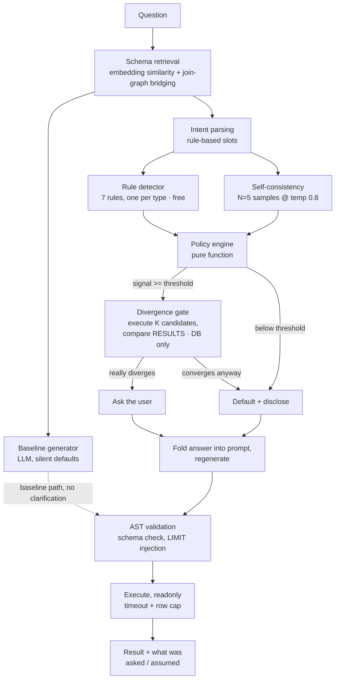

# Don't Ask Unless It Matters: Building a Text-to-SQL Clarification Engine

### Most text-to-SQL systems answer ambiguous questions confidently and wrongly. I built one that measures whether the ambiguity would actually change the answer before it decides to interrupt you — and then measured how often it gets that call right.

---

## The 30-second version

Ask a text-to-SQL system *"Who is our best customer?"* and it will answer. Confidently. With a real name and a real number.

Here's what happened when I asked exactly that against my seeded e-commerce database:

**Baseline system** (silently picks revenue): Michael Clarke, Christy Bolton, Charles Baker, Alex Nguyen, Monica Coleman — 9 to 16 orders each, $30K–$40K in revenue.

**Same system, after asking "which metric did you mean?" and being told "number of orders":** Michelle Phillips, Hunter Spencer, Christopher Mayer, Mary Hebert, Robert Brown — 43 to 45 orders each.

**Zero names in common.** Same question, same database. A completely different answer hinging on one word nobody defined. The baseline never mentioned that "best" was undefined — it just picked, and returned a formatted table that looks exactly like a correct answer.

I built a clarification layer to fix that, and evaluated it on a hand-built, held-out 80-question test set against five alternative strategies. The headline:

> **Baseline answered 95.1% of ambiguous questions confidently and wrongly** — no clarification, no disclosure, just a silently-wrong answer. **The full system reduced that to 22.0%, while interrupting the user on only 30.0% of all queries** (ambiguous and unambiguous combined).

---

## Why "wrong answer" is the wrong problem to worry about

There are two ways a text-to-SQL system fails, and they aren't equally bad. A **loud failure** — the SQL doesn't run, the number is absurd — gets caught immediately. A **silent failure** — the query runs, the result looks plausible, and it's quietly answering a different question than the one asked — does not. It gets pasted into a deck and trusted, *precisely because* the system never signaled it was unsure.

So the metric that actually matters is **silent-error rate**: the fraction of queries where the system was wrong *and* neither asked a question nor disclosed an assumption. Not raw accuracy — a wrong-but-disclosed answer is a fundamentally different failure than a wrong-and-confident one.

But there's an obvious cheat: ask a clarifying question on every query and silent-error rate goes to zero — at the cost of a system nobody wants to use. Annoying systems get bypassed, which lands you right back at silently-wrong-and-trusted, with extra steps. So the real problem is two-sided: **reduce silent errors while asking as rarely as possible.** The second number — **over-ask rate**, the fraction of *all* queries that get interrupted — is the one almost nobody publishes, because it's the one that makes clarification systems look chatty.

---

## Architecture at a glance

The design constraint visible in that diagram: **everything except the boxes that say LLM runs for free.** Retrieval, intent parsing, rule detection, the divergence gate, the policy engine, question rendering, AST validation — zero model calls. The only paid steps are baseline generation, the five self-consistency samples, and the post-clarification regeneration. A clarification layer that needs an expensive model call just to decide whether to ask a cheap question is solving the wrong problem.

---

## Ambiguity is not one problem

"Who is our best customer" and "how many orders came in last month" are both ambiguous, in completely unrelated ways. A system that treats them the same — one keyword list, one threshold — does badly at both. So before writing detection code, I catalogued the specific, concrete ways a question against this schema admits more than one defensible reading. Seven types showed up repeatedly across a hundred hand-written ambiguous questions, each with a worked example and **real executed numbers**, not asserted ones:

| Type | Question | Reading A | Reading B | Gap |
|---|---|---|---|---|
| **METRIC** | "Who is our best customer?" | net revenue → customer **1333** | order count → customer **3000** | Different entity entirely |
| **TEMPORAL** | "How many orders last month?" | calendar Nov → **4,361** | trailing 30d → **2,503** | 74% |
| **ENTITY** | "How many customers do we have?" | `customers` → **5,000** | active `users` → **7,589** | 52% |
| **SCOPE** | "How many orders have we had?" | all statuses → **40,341** | excl. cancelled → **37,531** | 2,810 orders |
| **GRAIN** | "What's our average order value?" | per-order → **$192.31** | per-customer → **$1,452.35** | 7.5× |
| **COMPARISON** | "Which category is growing fastest?" | MoM → Books **−32.0%** | vs 6-mo avg → Books **+3.5%** | Sign flips |
| **RESULT_SHAPE** | "Show me our top customers" | `LIMIT 5` | `LIMIT 10` | Different result sets |

The COMPARISON row is my favorite: same category, same data, same question — one reading says the business is shrinking, the other says it's growing. Not a rounding difference. Opposite answers.

This groundwork mattered more than any individual piece of detection logic downstream. It's the difference between *"ask a model if this is ambiguous"* — which conflates seven distinct problems into one vague judgment call — and having **seven specific, checkable hypotheses** about what could be wrong with a given question.

Underneath the taxonomy sits a small semantic layer — a handful of YAML files mapping each metric to a SQL expression, a default scope, and a **deliberately overlapping synonym list**. "Best," "top," and "most valuable" all appear in the synonym lists for *revenue*, *order count*, and *session count* at once. When the intent parser matches a question's words against that vocabulary and gets more than one metric back, that multi-candidate result **is** the ambiguity signal — not a separate "is this vague?" heuristic bolted on afterward, but something that falls directly out of the vocabulary's own structure. The same layer also carries the house defaults (net-of-refunds over gross, exclude internal accounts, anchor "last month" to the data's own latest order rather than wall-clock time, so the ambiguity stays reproducible no matter when the benchmark gets re-run) — the choices the system falls back on when it decides not to ask, and discloses instead.

---

## The pipeline, in order

**Retrieval** embeds the question, pulls the most relevant tables by cosine similarity, then expands the selection along the join graph so a semantically-boring bridge table (needed to actually join two selected tables) never gets silently dropped.

**Detection** runs two independent mechanisms. A **rule detector** — one rule per ambiguity type, tuned for precision over recall — matches keywords and structural cues against the semantic layer's vocabulary. Separately, **self-consistency** generates five candidate SQL queries at temperature 0.8 and checks whether the model agrees with itself: candidates are parsed into a semantic signature (tables, projections, group-by, predicates) rather than compared as text, since two queries computing the identical thing routinely pick different aliases. Disagreement across the five samples is itself a signal, independent of any hand-written rule.

**The divergence gate is the idea the whole project rests on:** don't ask because a question *looks* ambiguous — ask because two plausible readings would give *visibly different answers*. If "average order value" splits $47.20 vs $47.80 depending on grain, nobody needs to be interrupted. If it splits $192 vs $1,452 — as it actually does here — that's a real fork. The mechanism is almost embarrassingly simple: take the candidate SQL for each reading, **actually execute them**, and compare the results — rank-overlap for lists, relative difference for scalars, correlation for time series, never raw SQL text. Once candidate SQL already exists, this is a handful of read-only database queries, not another model call — which is what makes it nearly free despite being the component that matters most.

**The policy engine** is a pure function: given what's detected, what's already resolved this session, and how many times the session has already asked, decide to ask or to default-and-disclose. Capped at two clarifications per session — a system that keeps asking is failing in a different way than a system that never asks, and the failure is just as real. Every defaulted slot lands in the output's disclosure text; nothing is silent either way.

**Resolution** folds an answer (or a default) into a fresh generation call. **Validation** checks the result against the live schema — catching a hallucinated column before it becomes a database error, not after. **Execution** runs read-only, with a timeout and a row cap.

---

## The benchmark under it

None of the above means anything without a number attached, and a number is only as good as the dataset under it. So: 200 hand-constructed, hand-verified questions — 100 unambiguous, 100 ambiguous — against the seeded schema. For every ambiguous item, every reading's SQL was written and *executed* against the live database, and the actual divergence between readings was measured before the item got labeled `high` or `low` — several items got relabeled when the computed number contradicted my original guess (my favorite: "average refund amount" looked like it should split the way average-order-value does, and turned out to be exactly identical, because no order in this seed data has more than one refund row). 27 of the 100 ambiguous items are deliberate near-misses — phrasing that *looks* ambiguous but whose readings converge anyway — specifically so the over-ask metric has something real to measure against.

The set splits 60/40 into dev and test, with one rule enforced throughout: **the test split is touched exactly once**, at the very end, so every threshold and every detector decision upstream is answerable without having peeked at the number that's supposed to be the final grade.

## The results

Held-out test set, 80 items, run exactly once. Six configurations, same dataset: a plain baseline with no detection; a single "is this ambiguous?" LLM call (what most people build first); rule-based detection alone; self-consistency alone; the two combined; and the full system with the divergence gate on top.

| config | correctness | over-ask rate | silent-error rate |
|---|---|---|---|
| baseline | 23.8% | 0.0% | **76.2%** |
| llm_judge | 25.0% | 38.8% | 40.0% |
| rules_only | 25.0% | 45.0% | 35.0% |
| self_consistency_only | 23.8% | 18.8% | 57.5% |
| hybrid_no_gate | 25.0% | 50.0% | 30.0% |
| **full** | 23.8% | **30.0%** | **30.0%** |

Two things to read out of that table. First, correctness barely moves anywhere — a budget artifact (every config, baseline included, ran on a cheap model, since this whole remaining project ran on a few dollars of API credit), not a hidden methodology flaw, and genuinely not the point. Second, and this is the actual headline: **silent-error rate drops from 76% to 30%** even though correctness doesn't improve, because a wrong-but-disclosed answer isn't the same failure as a wrong-and-confident one.

The load-bearing comparison is `full` vs. `hybrid_no_gate`: identical detection signal feeding both, but the divergence gate cuts over-asking from 50% to 30% with **zero cost to the silent-error rate** — same catches, a third fewer interruptions, and it does this without a single additional LLM call. That's the gate doing exactly the job it was built for, not a marginal improvement, a structural one.

Breaking the same run down by ambiguity type is where the aggregate number stops being flattering and starts being useful. METRIC, TEMPORAL, and COMPARISON questions all reach a **0% silent-error rate** under the full system — every one of those gets asked, or resolved correctly. GRAIN is the opposite story: a **0% over-ask rate** means the detector essentially never flags it, so its silent-error rate barely improves over baseline's own 100%. The type with the largest gap between "would matter" and "gets caught" — average order value, average sessions per user, the questions where the ambiguity is implicit in what an average even is — is exactly the one none of the three detection mechanisms reliably catch. Knowing *which* type is failing, not just that some fraction of questions are, is the entire reason the taxonomy was worth building before writing a line of detection code.

One concrete example from the held-out set: *"How much revenue have we made?"* — baseline and the full system produce **byte-identical SQL**. The only difference is that baseline picked net-of-refunds silently, while the full system detected the ambiguity, asked, and disclosed the choice before answering. Same answer, but the user now knows what was assumed instead of finding out the hard way later. That's the actual value proposition, and it shows up even when generation quality doesn't move at all.

---

## What didn't work

I built the self-consistency detector expecting it to be the workhorse — catch what rules can't, since it needs no hand-written keyword list. On the dev set, calibrating its threshold, I got a comfortable false-fire rate. On the held-out test set, its recall came in at **0.24–0.27**. It's precise — when it flags something it's usually right — but it misses roughly three-quarters of the real ambiguity on its own.

The honest diagnosis: this project deliberately used a cheap, fast model for detection, and that model is inconsistent about applying its own defaults across five independent samples — not because the question is ambiguous, but because it's sloppy. A stronger model would likely close a meaningful chunk of that gap; I didn't get to test that directly, because retuning a whole detector wasn't in the remaining budget. That's a real limitation, not a footnote — self-consistency is currently the weakest of the three signals, and the free rule detector alone beat it on precision.

A second, smaller finding, digging through the actual failures rather than trusting the aggregate table: one ambiguity type — row-count questions like "top customers" with no stated number — has a real bug, not just a weak signal. The rule detector correctly flags it as ambiguous but never proposes candidate row counts to offer, so the system asks a question it has no way to let anyone actually answer. Small, specific, and exactly the kind of thing an aggregate ablation table will never surface on its own.

---

## Why not just always ask?

Because the over-ask rate is the actual product. A system that interrupts on every ambiguous question is trivially safe and trivially annoying, and annoying systems get bypassed — which puts you right back at silently-wrong-and-trusted, just with extra steps. `full` asks on 30% of *all* queries, ambiguous and unambiguous combined, and that's the number I'd defend in a review, not the detection recall in isolation.

**Asking less, more precisely, is a harder engineering problem than asking more.** It's also the only version of a clarification layer I'd actually want sitting between a person and a database they're trying to trust.
